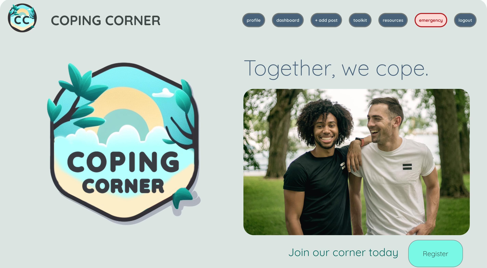

# Welcome to Coping Corner!

## Take a look
[Coping Corner has not yet been deployed!](https://media.tenor.com/bXaqMucdvMYAAAAd/when-the-coping-is-too-strong-cope.gif)

## Description
Coping Corner is a full-stack `Postresql/Express/React/Node` application with user authentication. Users are able to create an account and log in securely with their credentials. This application is made to create a community for those who are struggling to cope with their mental state and find resources to help them along their mental health journey. Users can add resources to their 'Toolkit,' as well as add likes to resources that they find helpful. Also, users can post their own resources to be viewed and accessed by other users of Coping Corner. We are often more likely to resonate with advice from our peers than from outsiders, so Coping Corner is meant to facilitate these connections and make a real impact on those who struggle with their mental health.

## Our Team
**Duncan Wood** 
*Git administrator* 
[LinkedIn](https://www.linkedin.com/in/duncanwoodpro/) | 
[Github](https://github.com/Duncan-Wood)
  

**Elliott Ventura** 
*Lead Backend* 
[LinkedIn](https://www.linkedin.com/in/elliottaventura/) | 
[Github](https://github.com/eventura26/)
  

**Quinn Landry** 
*Lead Frontend* 
[LinkedIn](https://www.linkedin.com/in/quinn-landry-b24998235/) | 
[Github](https://github.com/qrlandry)
  

**Yael Kaufman** 
*Lead Designer* 
[LinkedIn](https://www.linkedin.com/in/yael-kaufman/) | 
[Github](https://github.com/ykallday)

## Technologies Used
- Javascript, HTML, & CSS
- Axios
- React
    - Routes/Route
    - Link/useNavigate
    - useContext
    - useState
    - useEffect
    - useParams
- Vanessa Trine Therapy Services for Resource Cards 
- Midjourney AI for the logo design
- Photoshop for refining design
- Material Design Builder for the design palettes
- ChatGPT AI for debugging and rubberducking

## Getting Started
- Fork and Clone this repository in your CLI
- cd into the directory you just cloned
- npm install to install necessary components
- npm start to run app in localhost

## Check Out Our Backend!
[Coping Corner Backend](https://github.com/Duncan-Wood/Coping-Corner-Backend)

## Contribution Guidelines
We are honored that you would like to contribute to our app! Please contact any member on our team using the links above for any inquiries, to report bugs, or to propose improvements.
